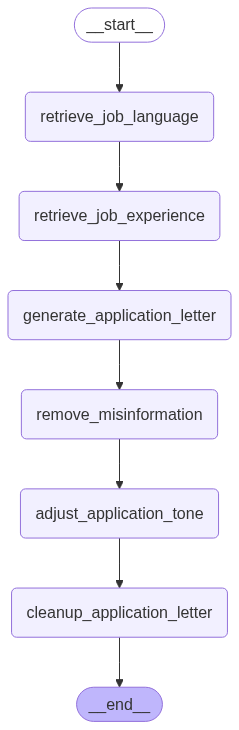

# Applai - The job application assistant

An AI-powered tool that automates the job application process by generating customized cover letters based on your resume and job descriptions. The system uses a sophisticated workflow combining RAG (Retrieval Augmented Generation) with LLMs to ensure relevant experience is highlighted and maintain factual accuracy.

## Workflow

The application follows this process:

1. Retrieves job language and context
2. Gets relevant experience from resume using RAG
3. Generates initial application letter
4. Removes potential misinformation
5. Adjusts tone for professionalism
6. Cleans up the final letter

## Features

- Resume parsing in multiple languages (English/German)
- Automated job scraping from online portals
- Customized cover letter generation
- Fact-checking against resume data
- Professional tone adjustment
- Bulk application support
